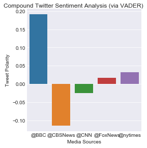

```python
# Dependencies
import tweepy
import json
import numpy as np
import pandas as pd
import matplotlib.pyplot as plt
import seaborn as sns
from vaderSentiment.vaderSentiment import SentimentIntensityAnalyzer
analyzer = SentimentIntensityAnalyzer()
# %matplotlib qt5
%matplotlib inline

# Setup Tweepy API Authentication
auth = tweepy.OAuthHandler(consumer_key, consumer_secret)
auth.set_access_token(access_token, access_token_secret)
api = tweepy.API(auth, parser=tweepy.parsers.JSONParser())


```


```python
# Twitter API Keys
consumer_key = "ENTERKEYHERE"
consumer_secret = "ENTERKEYHERE"
access_token = "ENTERKEYHERE"
access_token_secret = "ENTERKEYHERE"

# variables

number_to_search = 100
# target_term = ["@CNNbrk","@FoxNews","@MSNBC","@business","@BBCWorld","@NewsHour","@TheOnion","@ComedyCentral"]

# target_term = ["@CNNbrk", "@FoxNews"]

target_term = ["@BBC","@CBSNews","@CNN","@FoxNews","@nytimes"]

```


```python
# start up a dataframe

df = pd.DataFrame({
    "screen_name" : "",
    "compound" : "",
    "tweets_ago" : "",
    "positive": "",
    "negative" : "",
    "neutral" : "",
    "date" : "",
    "text" : ""
},
    index=[1]
)

index = 1

for item in target_term:
    compound_list = []
    positive_list = []
    negative_list = []
    neutral_list = []
    counter = 0
    
    # Grab tweets, in chrono order since result_type = 'recent'
#     public_tweets = api.search(item,count=1,result_type="recent",tweet_mode='extended')

    public_tweets = api.user_timeline(screen_name=item, count=number_to_search, result_type="recent", tweet_mode="extended")
   
    print(item)

    # Loop through all tweets
    for tweet in public_tweets:

        try:
            message = tweet["retweeted_status"]["full_text"]
        except:
            message = tweet["full_text"]
#         print(message)


        compound = analyzer.polarity_scores(message)["compound"]
        pos = analyzer.polarity_scores(message)["pos"]
        neu = analyzer.polarity_scores(message)["neu"]
        neg = analyzer.polarity_scores(message)["neg"]
#         print(compound)
        compound_list.append(compound)

        df.set_value(index,["screen_name"],item)
        df.set_value(index,["compound"],compound)
        df.set_value(index,["positive"],pos)
        df.set_value(index,["negative"],neg)
        df.set_value(index,["neutral"],neu)
        df.set_value(index,["tweets_ago"],counter)
        df.set_value(index,["date"],tweet["created_at"])
        df.set_value(index,["text"],message)

        
        index = len(df) + 1
        counter = counter + 1
        
```

    @BBC


    /Users/m/anaconda2/envs/PythonData/lib/python3.6/site-packages/ipykernel/__main__.py:49: FutureWarning: set_value is deprecated and will be removed in a future release. Please use .at[] or .iat[] accessors instead
    /Users/m/anaconda2/envs/PythonData/lib/python3.6/site-packages/ipykernel/__main__.py:50: FutureWarning: set_value is deprecated and will be removed in a future release. Please use .at[] or .iat[] accessors instead
    /Users/m/anaconda2/envs/PythonData/lib/python3.6/site-packages/ipykernel/__main__.py:51: FutureWarning: set_value is deprecated and will be removed in a future release. Please use .at[] or .iat[] accessors instead
    /Users/m/anaconda2/envs/PythonData/lib/python3.6/site-packages/ipykernel/__main__.py:52: FutureWarning: set_value is deprecated and will be removed in a future release. Please use .at[] or .iat[] accessors instead
    /Users/m/anaconda2/envs/PythonData/lib/python3.6/site-packages/ipykernel/__main__.py:53: FutureWarning: set_value is deprecated and will be removed in a future release. Please use .at[] or .iat[] accessors instead
    /Users/m/anaconda2/envs/PythonData/lib/python3.6/site-packages/ipykernel/__main__.py:54: FutureWarning: set_value is deprecated and will be removed in a future release. Please use .at[] or .iat[] accessors instead
    /Users/m/anaconda2/envs/PythonData/lib/python3.6/site-packages/ipykernel/__main__.py:55: FutureWarning: set_value is deprecated and will be removed in a future release. Please use .at[] or .iat[] accessors instead


    @CBSNews
    @CNN
    @FoxNews
    @nytimes


    /Users/m/anaconda2/envs/PythonData/lib/python3.6/site-packages/ipykernel/__main__.py:56: FutureWarning: set_value is deprecated and will be removed in a future release. Please use .at[] or .iat[] accessors instead


```python
df
# df.set_index('screen_name')
# test=df.loc[df['screen_name']==item].reset_index()

```


<div>
<style scoped>
    .dataframe tbody tr th:only-of-type {
        vertical-align: middle;
    }

    .dataframe tbody tr th {
        vertical-align: top;
    }

    .dataframe thead th {
        text-align: right;
    }
</style>
<table border="1" class="dataframe">
  <thead>
    <tr style="text-align: right;">
      <th></th>
      <th>compound</th>
      <th>date</th>
      <th>negative</th>
      <th>neutral</th>
      <th>positive</th>
      <th>screen_name</th>
      <th>text</th>
      <th>tweets_ago</th>
    </tr>
  </thead>
  <tbody>
    <tr>
      <th>1</th>
      <td>0</td>
      <td>Mon Mar 05 19:30:07 +0000 2018</td>
      <td>0</td>
      <td>1</td>
      <td>0</td>
      <td>@BBC</td>
      <td>😂 Who actually watched the #Oscars? https://t....</td>
      <td>0</td>
    </tr>
    <tr>
      <th>2</th>
      <td>-0.8343</td>
      <td>Mon Mar 05 18:38:04 +0000 2018</td>
      <td>0.306</td>
      <td>0.648</td>
      <td>0.046</td>
      <td>@BBC</td>
      <td>No meat. No fish. No eggs. No milk. No cheese....</td>
      <td>1</td>
    </tr>
    <tr>
      <th>3</th>
      <td>0.6124</td>
      <td>Mon Mar 05 17:23:22 +0000 2018</td>
      <td>0</td>
      <td>0.737</td>
      <td>0.263</td>
      <td>@BBC</td>
      <td>Like father, like daughter.\n\n😂🔥 @GordonRamsa...</td>
      <td>2</td>
    </tr>
    <tr>
      <th>4</th>
      <td>0.4472</td>
      <td>Mon Mar 05 17:15:34 +0000 2018</td>
      <td>0</td>
      <td>0.754</td>
      <td>0.246</td>
      <td>@BBC</td>
      <td>The little mouse that inspired Pikachu is actu...</td>
      <td>3</td>
    </tr>
    <tr>
      <th>5</th>
      <td>0.1531</td>
      <td>Mon Mar 05 17:00:31 +0000 2018</td>
      <td>0.065</td>
      <td>0.846</td>
      <td>0.088</td>
      <td>@BBC</td>
      <td>"I made a promise to our six-year-old lead act...</td>
      <td>4</td>
    </tr>
    <tr>
      <th>6</th>
      <td>0</td>
      <td>Mon Mar 05 14:48:43 +0000 2018</td>
      <td>0</td>
      <td>1</td>
      <td>0</td>
      <td>@BBC</td>
      <td>As it's Hexagonal Phase approaches, a brief hi...</td>
      <td>5</td>
    </tr>
    <tr>
      <th>7</th>
      <td>-0.1779</td>
      <td>Mon Mar 05 14:43:13 +0000 2018</td>
      <td>0.175</td>
      <td>0.825</td>
      <td>0</td>
      <td>@BBC</td>
      <td>How did Julius Caesar hide his bald patch? htt...</td>
      <td>6</td>
    </tr>
    <tr>
      <th>8</th>
      <td>0</td>
      <td>Mon Mar 05 14:42:36 +0000 2018</td>
      <td>0</td>
      <td>1</td>
      <td>0</td>
      <td>@BBC</td>
      <td>Thursday is #InternationalWomensDay\n\nReflect...</td>
      <td>7</td>
    </tr>
    <tr>
      <th>9</th>
      <td>-0.6621</td>
      <td>Mon Mar 05 14:11:28 +0000 2018</td>
      <td>0.269</td>
      <td>0.731</td>
      <td>0</td>
      <td>@BBC</td>
      <td>When you almost (accidentally) kill @Harry_Sty...</td>
      <td>8</td>
    </tr>
    <tr>
      <th>10</th>
      <td>0</td>
      <td>Mon Mar 05 14:07:00 +0000 2018</td>
      <td>0</td>
      <td>1</td>
      <td>0</td>
      <td>@BBC</td>
      <td>Which football clubs charge the most for their...</td>
      <td>9</td>
    </tr>
    <tr>
      <th>11</th>
      <td>0.5927</td>
      <td>Mon Mar 05 13:17:03 +0000 2018</td>
      <td>0</td>
      <td>0.839</td>
      <td>0.161</td>
      <td>@BBC</td>
      <td>🐶💛 Little Ivor the Staffordshire puppy is deaf...</td>
      <td>10</td>
    </tr>
    <tr>
      <th>12</th>
      <td>0</td>
      <td>Mon Mar 05 13:07:19 +0000 2018</td>
      <td>0</td>
      <td>1</td>
      <td>0</td>
      <td>@BBC</td>
      <td>#MeatFreeMonday + #BritishPieWeek = Lancashire...</td>
      <td>11</td>
    </tr>
    <tr>
      <th>13</th>
      <td>0.6369</td>
      <td>Mon Mar 05 12:34:04 +0000 2018</td>
      <td>0</td>
      <td>0.811</td>
      <td>0.189</td>
      <td>@BBC</td>
      <td>What is the best way to cope with adult acne? ...</td>
      <td>12</td>
    </tr>
    <tr>
      <th>14</th>
      <td>0.5267</td>
      <td>Mon Mar 05 12:33:12 +0000 2018</td>
      <td>0</td>
      <td>0.923</td>
      <td>0.077</td>
      <td>@BBC</td>
      <td>It was a feat some doctors said was impossible...</td>
      <td>13</td>
    </tr>
    <tr>
      <th>15</th>
      <td>0.4199</td>
      <td>Mon Mar 05 11:54:02 +0000 2018</td>
      <td>0</td>
      <td>0.843</td>
      <td>0.157</td>
      <td>@BBC</td>
      <td>🐋🏊 What an experience!  \nThis is what it's li...</td>
      <td>14</td>
    </tr>
    <tr>
      <th>16</th>
      <td>0.7845</td>
      <td>Mon Mar 05 11:37:55 +0000 2018</td>
      <td>0</td>
      <td>0.67</td>
      <td>0.33</td>
      <td>@BBC</td>
      <td>❤️ Just adorable. \nHow would you react if you...</td>
      <td>15</td>
    </tr>
    <tr>
      <th>17</th>
      <td>0.7717</td>
      <td>Mon Mar 05 11:00:11 +0000 2018</td>
      <td>0</td>
      <td>0.782</td>
      <td>0.218</td>
      <td>@BBC</td>
      <td>This year's #Oscars have been handed out at th...</td>
      <td>16</td>
    </tr>
    <tr>
      <th>18</th>
      <td>0.8384</td>
      <td>Mon Mar 05 10:42:57 +0000 2018</td>
      <td>0</td>
      <td>0.668</td>
      <td>0.332</td>
      <td>@BBC</td>
      <td>It's #StPiransDay - so cheers to everyone! #Go...</td>
      <td>17</td>
    </tr>
    <tr>
      <th>19</th>
      <td>0.8126</td>
      <td>Mon Mar 05 10:42:50 +0000 2018</td>
      <td>0</td>
      <td>0.817</td>
      <td>0.183</td>
      <td>@BBC</td>
      <td>🥟 Gool Peran Lowen / Happy #StPiransDay to all...</td>
      <td>18</td>
    </tr>
    <tr>
      <th>20</th>
      <td>0</td>
      <td>Mon Mar 05 10:09:20 +0000 2018</td>
      <td>0</td>
      <td>1</td>
      <td>0</td>
      <td>@BBC</td>
      <td>Available now! 📲 Download the #Civilisations A...</td>
      <td>19</td>
    </tr>
    <tr>
      <th>21</th>
      <td>0.5267</td>
      <td>Mon Mar 05 09:58:23 +0000 2018</td>
      <td>0</td>
      <td>0.773</td>
      <td>0.227</td>
      <td>@BBC</td>
      <td>What'sthe first leg of @ZoeTheBall's epic Spor...</td>
      <td>20</td>
    </tr>
    <tr>
      <th>22</th>
      <td>0.7506</td>
      <td>Mon Mar 05 09:30:07 +0000 2018</td>
      <td>0</td>
      <td>0.726</td>
      <td>0.274</td>
      <td>@BBC</td>
      <td>🎭🎬#Oscars outfits designed to dazzle - all the...</td>
      <td>21</td>
    </tr>
    <tr>
      <th>23</th>
      <td>0</td>
      <td>Mon Mar 05 09:00:05 +0000 2018</td>
      <td>0</td>
      <td>1</td>
      <td>0</td>
      <td>@BBC</td>
      <td>😍 A rare pure-white stoat! https://t.co/VoR9jX...</td>
      <td>22</td>
    </tr>
    <tr>
      <th>24</th>
      <td>0</td>
      <td>Mon Mar 05 08:30:04 +0000 2018</td>
      <td>0</td>
      <td>1</td>
      <td>0</td>
      <td>@BBC</td>
      <td>Many personality traits can be observed but th...</td>
      <td>23</td>
    </tr>
    <tr>
      <th>25</th>
      <td>0</td>
      <td>Mon Mar 05 08:00:04 +0000 2018</td>
      <td>0</td>
      <td>1</td>
      <td>0</td>
      <td>@BBC</td>
      <td>🐝🍯 How honey is collected.\n#AmazingHotels htt...</td>
      <td>24</td>
    </tr>
    <tr>
      <th>26</th>
      <td>0.4019</td>
      <td>Sun Mar 04 20:11:35 +0000 2018</td>
      <td>0.101</td>
      <td>0.692</td>
      <td>0.208</td>
      <td>@BBC</td>
      <td>Miss Piggy has some strong feelings about this...</td>
      <td>25</td>
    </tr>
    <tr>
      <th>27</th>
      <td>0.8468</td>
      <td>Sun Mar 04 19:00:05 +0000 2018</td>
      <td>0</td>
      <td>0.614</td>
      <td>0.386</td>
      <td>@BBC</td>
      <td>Sloths have survived for more than 60 million ...</td>
      <td>26</td>
    </tr>
    <tr>
      <th>28</th>
      <td>0.4215</td>
      <td>Sun Mar 04 18:59:39 +0000 2018</td>
      <td>0</td>
      <td>0.872</td>
      <td>0.128</td>
      <td>@BBC</td>
      <td>Watch this baby chimp being flown to a new hom...</td>
      <td>27</td>
    </tr>
    <tr>
      <th>29</th>
      <td>0.296</td>
      <td>Sun Mar 04 18:00:09 +0000 2018</td>
      <td>0.061</td>
      <td>0.847</td>
      <td>0.093</td>
      <td>@BBC</td>
      <td>🎬🏆 So you've got the critical acclaim, you've ...</td>
      <td>28</td>
    </tr>
    <tr>
      <th>30</th>
      <td>0.4588</td>
      <td>Sun Mar 04 16:57:46 +0000 2018</td>
      <td>0</td>
      <td>0.9</td>
      <td>0.1</td>
      <td>@BBC</td>
      <td>What can we expect from the 90th Academy Award...</td>
      <td>29</td>
    </tr>
    <tr>
      <th>...</th>
      <td>...</td>
      <td>...</td>
      <td>...</td>
      <td>...</td>
      <td>...</td>
      <td>...</td>
      <td>...</td>
      <td>...</td>
    </tr>
    <tr>
      <th>471</th>
      <td>-0.3818</td>
      <td>Mon Mar 05 17:24:15 +0000 2018</td>
      <td>0.126</td>
      <td>0.874</td>
      <td>0</td>
      <td>@nytimes</td>
      <td>President Trump used his newly announced steel...</td>
      <td>70</td>
    </tr>
    <tr>
      <th>472</th>
      <td>0</td>
      <td>Mon Mar 05 17:15:03 +0000 2018</td>
      <td>0</td>
      <td>1</td>
      <td>0</td>
      <td>@nytimes</td>
      <td>In search of reasonable rent, the middle-class...</td>
      <td>71</td>
    </tr>
    <tr>
      <th>473</th>
      <td>-0.0516</td>
      <td>Mon Mar 05 17:00:25 +0000 2018</td>
      <td>0.163</td>
      <td>0.684</td>
      <td>0.153</td>
      <td>@nytimes</td>
      <td>A look at the most memorable moments — for bet...</td>
      <td>72</td>
    </tr>
    <tr>
      <th>474</th>
      <td>-0.25</td>
      <td>Mon Mar 05 16:52:11 +0000 2018</td>
      <td>0.171</td>
      <td>0.736</td>
      <td>0.093</td>
      <td>@nytimes</td>
      <td>History is full of movements led by students. ...</td>
      <td>73</td>
    </tr>
    <tr>
      <th>475</th>
      <td>-0.4404</td>
      <td>Mon Mar 05 16:45:08 +0000 2018</td>
      <td>0.153</td>
      <td>0.847</td>
      <td>0</td>
      <td>@nytimes</td>
      <td>Condom use, bondage, dirty talk, sexting: an a...</td>
      <td>74</td>
    </tr>
    <tr>
      <th>476</th>
      <td>0.34</td>
      <td>Mon Mar 05 16:30:29 +0000 2018</td>
      <td>0</td>
      <td>0.876</td>
      <td>0.124</td>
      <td>@nytimes</td>
      <td>Fashion played an anonymous role at the Oscars...</td>
      <td>75</td>
    </tr>
    <tr>
      <th>477</th>
      <td>0.0258</td>
      <td>Mon Mar 05 16:23:01 +0000 2018</td>
      <td>0</td>
      <td>0.936</td>
      <td>0.064</td>
      <td>@nytimes</td>
      <td>This scene is unfolding today at Trump Hotel i...</td>
      <td>76</td>
    </tr>
    <tr>
      <th>478</th>
      <td>0.2247</td>
      <td>Mon Mar 05 16:15:09 +0000 2018</td>
      <td>0</td>
      <td>0.917</td>
      <td>0.083</td>
      <td>@nytimes</td>
      <td>“There are more complexities here than in brai...</td>
      <td>77</td>
    </tr>
    <tr>
      <th>479</th>
      <td>0.296</td>
      <td>Mon Mar 05 16:00:44 +0000 2018</td>
      <td>0.103</td>
      <td>0.735</td>
      <td>0.162</td>
      <td>@nytimes</td>
      <td>In a haunting conversation, 6 teenagers who su...</td>
      <td>78</td>
    </tr>
    <tr>
      <th>480</th>
      <td>0.4019</td>
      <td>Mon Mar 05 15:50:24 +0000 2018</td>
      <td>0</td>
      <td>0.895</td>
      <td>0.105</td>
      <td>@nytimes</td>
      <td>An escort said she had more than 16 hours of a...</td>
      <td>79</td>
    </tr>
    <tr>
      <th>481</th>
      <td>0</td>
      <td>Mon Mar 05 15:45:11 +0000 2018</td>
      <td>0</td>
      <td>1</td>
      <td>0</td>
      <td>@nytimes</td>
      <td>Jimmy Kimmel threw barbs at Harvey Weinstein, ...</td>
      <td>80</td>
    </tr>
    <tr>
      <th>482</th>
      <td>0</td>
      <td>Mon Mar 05 15:30:17 +0000 2018</td>
      <td>0</td>
      <td>1</td>
      <td>0</td>
      <td>@nytimes</td>
      <td>Here’s what you need to know to start your day...</td>
      <td>81</td>
    </tr>
    <tr>
      <th>483</th>
      <td>0</td>
      <td>Mon Mar 05 15:15:07 +0000 2018</td>
      <td>0</td>
      <td>1</td>
      <td>0</td>
      <td>@nytimes</td>
      <td>Photos from the Oscars red carpet https://t.co...</td>
      <td>82</td>
    </tr>
    <tr>
      <th>484</th>
      <td>-0.6249</td>
      <td>Mon Mar 05 15:00:11 +0000 2018</td>
      <td>0.282</td>
      <td>0.718</td>
      <td>0</td>
      <td>@nytimes</td>
      <td>Anti-immigrant and anti-establishment anger ap...</td>
      <td>83</td>
    </tr>
    <tr>
      <th>485</th>
      <td>0.836</td>
      <td>Mon Mar 05 14:45:09 +0000 2018</td>
      <td>0</td>
      <td>0.706</td>
      <td>0.294</td>
      <td>@nytimes</td>
      <td>“The Shape of Water” won best picture at an Os...</td>
      <td>84</td>
    </tr>
    <tr>
      <th>486</th>
      <td>0.6705</td>
      <td>Mon Mar 05 14:35:07 +0000 2018</td>
      <td>0</td>
      <td>0.756</td>
      <td>0.244</td>
      <td>@nytimes</td>
      <td>South Korean envoys met North Korea's leader t...</td>
      <td>85</td>
    </tr>
    <tr>
      <th>487</th>
      <td>0</td>
      <td>Mon Mar 05 14:20:07 +0000 2018</td>
      <td>0</td>
      <td>1</td>
      <td>0</td>
      <td>@nytimes</td>
      <td>Around the world, parents have preferred to ha...</td>
      <td>86</td>
    </tr>
    <tr>
      <th>488</th>
      <td>0.6597</td>
      <td>Mon Mar 05 14:10:02 +0000 2018</td>
      <td>0</td>
      <td>0.833</td>
      <td>0.167</td>
      <td>@nytimes</td>
      <td>Lupita Nyong'o: "We are dreamers. We grew up d...</td>
      <td>87</td>
    </tr>
    <tr>
      <th>489</th>
      <td>-0.9225</td>
      <td>Mon Mar 05 13:55:01 +0000 2018</td>
      <td>0.442</td>
      <td>0.558</td>
      <td>0</td>
      <td>@nytimes</td>
      <td>Opioids are not America’s only significant dru...</td>
      <td>88</td>
    </tr>
    <tr>
      <th>490</th>
      <td>0.4588</td>
      <td>Mon Mar 05 13:40:11 +0000 2018</td>
      <td>0</td>
      <td>0.9</td>
      <td>0.1</td>
      <td>@nytimes</td>
      <td>Tiffany Haddish and Maya Rudolph brought some ...</td>
      <td>89</td>
    </tr>
    <tr>
      <th>491</th>
      <td>0</td>
      <td>Mon Mar 05 13:30:03 +0000 2018</td>
      <td>0</td>
      <td>1</td>
      <td>0</td>
      <td>@nytimes</td>
      <td>Is Phillip Picardi, a former intern who now he...</td>
      <td>90</td>
    </tr>
    <tr>
      <th>492</th>
      <td>0</td>
      <td>Mon Mar 05 13:25:06 +0000 2018</td>
      <td>0</td>
      <td>1</td>
      <td>0</td>
      <td>@nytimes</td>
      <td>Jimmy Kimmel threw barbs at Harvey Weinstein, ...</td>
      <td>91</td>
    </tr>
    <tr>
      <th>493</th>
      <td>0.296</td>
      <td>Mon Mar 05 13:13:07 +0000 2018</td>
      <td>0.056</td>
      <td>0.856</td>
      <td>0.088</td>
      <td>@nytimes</td>
      <td>On today’s Daily: a haunting conversation betw...</td>
      <td>92</td>
    </tr>
    <tr>
      <th>494</th>
      <td>0</td>
      <td>Mon Mar 05 13:10:06 +0000 2018</td>
      <td>0</td>
      <td>1</td>
      <td>0</td>
      <td>@nytimes</td>
      <td>Here’s what you need to know to start your day...</td>
      <td>93</td>
    </tr>
    <tr>
      <th>495</th>
      <td>0</td>
      <td>Mon Mar 05 12:56:44 +0000 2018</td>
      <td>0</td>
      <td>1</td>
      <td>0</td>
      <td>@nytimes</td>
      <td>One famous designer chair is oozing goop. Anot...</td>
      <td>94</td>
    </tr>
    <tr>
      <th>496</th>
      <td>0</td>
      <td>Mon Mar 05 12:40:13 +0000 2018</td>
      <td>0</td>
      <td>1</td>
      <td>0</td>
      <td>@nytimes</td>
      <td>Photos from the Oscars red carpet https://t.co...</td>
      <td>95</td>
    </tr>
    <tr>
      <th>497</th>
      <td>0.4767</td>
      <td>Mon Mar 05 12:22:02 +0000 2018</td>
      <td>0</td>
      <td>0.744</td>
      <td>0.256</td>
      <td>@nytimes</td>
      <td>The complete list of winners at the 2018 Oscar...</td>
      <td>96</td>
    </tr>
    <tr>
      <th>498</th>
      <td>0.2732</td>
      <td>Mon Mar 05 11:50:09 +0000 2018</td>
      <td>0</td>
      <td>0.769</td>
      <td>0.231</td>
      <td>@nytimes</td>
      <td>The Cycling Panther of Paris’s Fitness Studios...</td>
      <td>97</td>
    </tr>
    <tr>
      <th>499</th>
      <td>-0.3182</td>
      <td>Mon Mar 05 11:41:27 +0000 2018</td>
      <td>0.187</td>
      <td>0.813</td>
      <td>0</td>
      <td>@nytimes</td>
      <td>Personal Health: Jane Brody’s Personal Secrets...</td>
      <td>98</td>
    </tr>
    <tr>
      <th>500</th>
      <td>-0.2732</td>
      <td>Mon Mar 05 11:26:47 +0000 2018</td>
      <td>0.12</td>
      <td>0.792</td>
      <td>0.088</td>
      <td>@nytimes</td>
      <td>“I don’t think it is the worst hotel in the wo...</td>
      <td>99</td>
    </tr>
  </tbody>
</table>
<p>500 rows × 8 columns</p>
</div>


```python
# plot one

graph_one = sns.lmplot( x="tweets_ago", y="compound", data=df, size=4.5, aspect=3,fit_reg=False,hue='screen_name', legend=False, scatter_kws={"alpha":0.95, "linewidth":.35,'edgecolor':"k","s":55})


plt.ylim(-1,1)
plt.xlim(0, number_to_search) 

plt.xlabel("Tweets Ago")
plt.ylabel("Tweet Polarity")
plt.suptitle("Twitter Sentiment Analysis (via VADER)",y=1)

box = graph_one.ax.get_position() # get position of figure
graph_one.ax.set_position([box.x0, box.y0 + box.height * 0.1,
                 box.width, box.height * 0.9])
graph_one.ax.legend(loc='upper center', bbox_to_anchor=(0.5, -.1), fancybox=True, shadow=True, ncol=5).set_title("Media Sources")

ylabels = ['-1','-.5','0','+.5','+1']
graph_one.ax.set_yticks([-1,-.5,0,.5,1])
graph_one.ax.set_yticklabels(ylabels)

plt.savefig('plot1.png')
```


```python
# clean it up for the barplot.

overall_df = pd.DataFrame({
    'screen_name' : [],
    'compound': []
}
)
overall_df
```


<div>
<style scoped>
    .dataframe tbody tr th:only-of-type {
        vertical-align: middle;
    }

    .dataframe tbody tr th {
        vertical-align: top;
    }

    .dataframe thead th {
        text-align: right;
    }
</style>
<table border="1" class="dataframe">
  <thead>
    <tr style="text-align: right;">
      <th></th>
      <th>compound</th>
      <th>screen_name</th>
    </tr>
  </thead>
  <tbody>
  </tbody>
</table>
</div>


```python
# test = overall_df.set_index("screen_name")
# test.head()
```


```python
for item in target_term:
    isolated=df.loc[df['screen_name']==item]
    overall_sentiment=isolated["compound"].mean()
    print(overall_sentiment)
#     df.set_value(index,["screen_name"],item)
    overall_df = overall_df.append({'compound':overall_sentiment,'screen_name':item},ignore_index=True)
overall_df
```

    0.190725
    -0.114582
    -0.024584
    0.017072
    0.031807


<div>
<style scoped>
    .dataframe tbody tr th:only-of-type {
        vertical-align: middle;
    }

    .dataframe tbody tr th {
        vertical-align: top;
    }

    .dataframe thead th {
        text-align: right;
    }
</style>
<table border="1" class="dataframe">
  <thead>
    <tr style="text-align: right;">
      <th></th>
      <th>compound</th>
      <th>screen_name</th>
    </tr>
  </thead>
  <tbody>
    <tr>
      <th>0</th>
      <td>0.190725</td>
      <td>@BBC</td>
    </tr>
    <tr>
      <th>1</th>
      <td>-0.114582</td>
      <td>@CBSNews</td>
    </tr>
    <tr>
      <th>2</th>
      <td>-0.024584</td>
      <td>@CNN</td>
    </tr>
    <tr>
      <th>3</th>
      <td>0.017072</td>
      <td>@FoxNews</td>
    </tr>
    <tr>
      <th>4</th>
      <td>0.031807</td>
      <td>@nytimes</td>
    </tr>
  </tbody>
</table>
</div>


```python
# a boxplot for seth
# %matplotlib qt5
ax = sns.boxplot(x=df["screen_name"], y=df["compound"].astype(float), 
                 data=overall_df,
                 linewidth=2, saturation=50)


plt.ylim(-1,1)

plt.xlabel("Media Sources")
plt.ylabel("Tweet Polarity")
plt.suptitle("Compound Twitter Sentiment Analysis (via VADER)",y=1)

ylabels = ['-1','-.5','0','+.5','+1']
ax.set_yticks([-1,-.5,0,.5,1])
ax.set_yticklabels(ylabels)

plt.show()
# plt.savefig('boxplot.png')
```

    /Users/m/anaconda2/envs/PythonData/lib/python3.6/site-packages/seaborn/categorical.py:462: FutureWarning: remove_na is deprecated and is a private function. Do not use.
      box_data = remove_na(group_data)


```python
# a barplot like i was supposed to make instead of a boxplot but since i never learnt to 
# read i forced a boxplot to make sense instead. which it didnt. so here's a barplot.

ax = sns.barplot(x=df["screen_name"],y=df["compound"].astype(float), hue=df["screen_name"],
                errwidth=0, dodge=False, alpha=0.9, linewidth=1.5,edgecolor="black",
                xerr=None,yerr=None, snap=False)
sns.despine(offset=10, trim=True)
box = ax.get_position() # get position of figure
ax.set_position([box.x0, box.y0 + box.height * 0.1,
                 box.width, box.height * 0.9])
ax.legend(loc='upper center', bbox_to_anchor=(0.5, -.15), fancybox=True, shadow=True, ncol=5).set_title("Media Sources")
plt.xlabel("Media Sources")
plt.ylabel("Tweet Polarity")
plt.suptitle("Compound Twitter Sentiment Analysis (via VADER)",y=1)


# plt.savefig("barplot.png")
```

    /Users/m/anaconda2/envs/PythonData/lib/python3.6/site-packages/seaborn/categorical.py:1508: FutureWarning: remove_na is deprecated and is a private function. Do not use.
      stat_data = remove_na(group_data[hue_mask])


    Text(0.5,1,'Compound Twitter Sentiment Analysis (via VADER)')


```python
# or as a factorplot
graph_two = sns.factorplot("screen_name","compound", data=overall_df,kind="bar")

plt.xlabel("Media Sources")
plt.ylabel("Tweet Polarity")
plt.suptitle("Compound Twitter Sentiment Analysis (via VADER)",y=1)
```

    /Users/m/anaconda2/envs/PythonData/lib/python3.6/site-packages/seaborn/categorical.py:1460: FutureWarning: remove_na is deprecated and is a private function. Do not use.
      stat_data = remove_na(group_data)


    Text(0.5,1,'Compound Twitter Sentiment Analysis (via VADER)')





3 Observable Trends:

1. The error bars of the barplot are all very close to eachother (close to the limits of -1 & +1 per each news outlet) suggesting that all 5 outlets have the same polarity

2. The closest to neutral compound score is actually FoxNews & the furthest from netural compound score is the BBC which is interesting cause FoxNews has a stigma of leaning one particular way whereas BBC's stigma is being british (neutral/flat affect)

3. As displayed in the "Tweets Ago" Polarity scatter plot, each outlet tweets alot and their sentiment is all over the place, suggesting that news is frequent and its presentation/subject is varied
